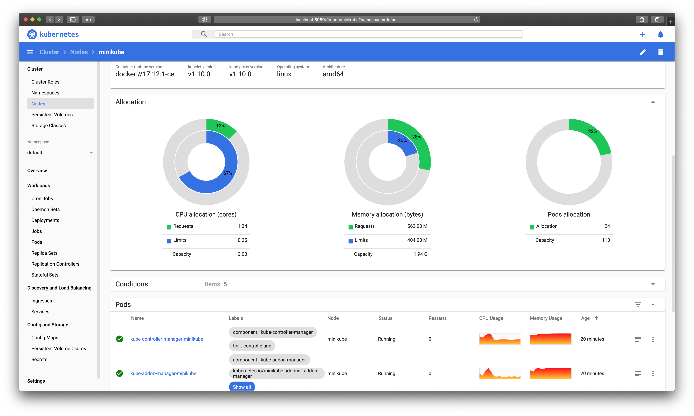

# Kubernetes Dashboard

[](https://travis-ci.org/kubernetes/dashboard)
[](https://codecov.io/github/kubernetes/dashboard?branch=master)
[](https://goreportcard.com/report/github.com/kubernetes/dashboard)
[](https://github.com/kubernetes/dashboard/releases/latest)
[](https://greenkeeper.io/)

Kubernetes Dashboard is a general purpose, web-based UI for Kubernetes clusters. It allows users to manage applications
running in the cluster and troubleshoot them, as well as manage the cluster itself.



## Deployment

**IMPORTANT:** As of version 1.7 Dashboard uses minimal privileges setup by default. It means, that some manual steps
are required to make it fully secure and functional. Before performing any steps read [Access Control](
https://github.com/kubernetes/dashboard/wiki/Access-control) guide.

### Recommended setup

Full security can be ensured only by accessing Dashboard over HTTPS. In order to enable HTTPS mode certificates need
to be passed to the application. This can be achieved by providing `--tls-cert-file` and `--tls-cert-key` flags to the
Dashboard. 

Assuming that you have `dashboard.crt` and `dashboard.key` files stored under `$HOME/certs` directory,
you need to create config map with contents of these files:

```bash
kubectl apply configmap kubernetes-dasboard-certs --from-file=$HOME/certs -n kube-system
```

Afterwards, you are ready to deploy Dashboard using following command:

```bash
kubectl apply -f https://raw.githubusercontent.com/kubernetes/dashboard/master/src/deploy/recommended/kubernetes-dashboard.yaml
```

### Alternative setup

This setup is not fully secure, however it does not require any additional steps. In this setup access control can be
ensured only by using [Authorization Header](
https://github.com/kubernetes/dashboard/wiki/Access-control#authorization-header) feature. To deploy Dashboard execute
following command:

```bash
kubectl apply -f https://raw.githubusercontent.com/kubernetes/dashboard/master/src/deploy/alternative/kubernetes-dashboard.yaml
```

**NOTE:** You can also install latest development builds with the newest features that the team works on by
following the [Development Release](https://github.com/kubernetes/dashboard/wiki/Installation#development-release)
guide.

**NOTE:** You need to have [Heapster](https://github.com/kubernetes/heapster/) running in your cluster for the metrics
and graphs to be available. You can read more about it in [Integrations](
https://github.com/kubernetes/dashboard/wiki/Integrations) guide.

## Usage

After installing Dashboard check [Accessing Dashboard](https://github.com/kubernetes/dashboard/wiki/Accessing-dashboard)
guide.

## Compatibility Matrix

|                     | Kubernetes 1.4 | Kubernetes 1.5 | Kubernetes 1.6 | Kubernetes 1.7 |
|---------------------|----------------|----------------|----------------|----------------|
| **Dashboard 1.4**   | ✓              | ✕              | ✕              | ✕              |
| **Dashboard 1.5**   | ✕              | ✓              | ✕              | ✕              |
| **Dashboard 1.6**   | ✕              | ✕              | ✓              | ?              |
| **Dashboard 1.7**   | ✕              | ✕              | ?              | ✓              |
| **Dashboard HEAD**  | ✕              | ✕              | ?              | ✓              |

- `✓` Fully supported version range.
- `?` Due to breaking changes between Kubernetes API versions, some features might not work in Dashboard (logs, search
etc.).
- `✕` Unsupported version range.

## Documentation

Dashboard documentation can be found on [Wiki pages](https://github.com/kubernetes/dashboard/wiki), it includes:

* Common: Entry-level overview

* User Guide: For anyone interested in using Dashboard

* Development Guide: For anyone interested in contributing

## License

The work done has been licensed under Apache License 2.0. The license file can be found[here](LICENSE). You can find
out more about the license at:

http://www.apache.org/licenses/LICENSE-2.0
