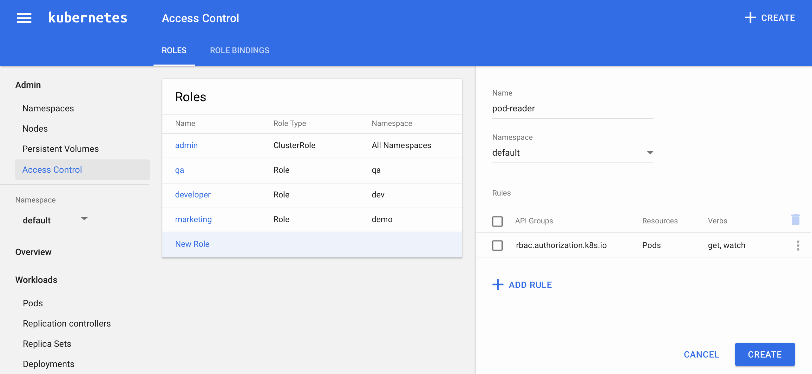
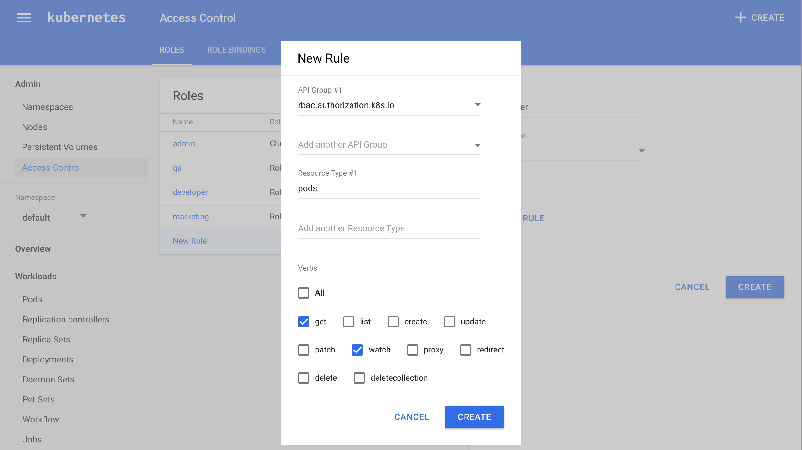
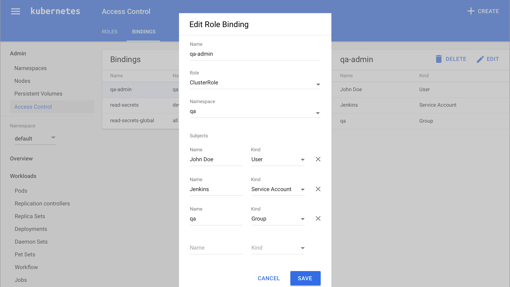

# UX for role-based access control

This design document is a proposal for a Dashboard UI that
allows users to manage Roles, RolesBindings, ClusterRoles, and 
ClusterRoleBindings in an intuitive way. This document is a 
formalization of ideas and discussions from #1441.

## Background

Kubernetes now allows cluster admins to use 
[role-based access control](http://kubernetes.io/docs/admin/authorization/) to secure their clusters. 
Permissions are managed using the following Kubernetes Resources:
* Role
* ClusterRole
* RoleBinding
* ClusterRoleBinding

None of these are reflected in the current version of Dashboard UI. There should a simplified, 
more user-friendly way to manage a cluster's access control by abstracting these raw concepts.

## Abstraction / Simplification

The only difference between Roles and ClusterRoles is that Roles apply to a specific namespace 
and ClusterRoles apply to all namespaces. The same is true for RoleBindings and ClusterRoleBindings. 
The UI should help users to understand these concepts and user flows should be designed to enforce
the correct usage. 

NOTE: The design proposed in this document will combine certain concepts:
* ClusterRoles will be referred to as Roles for the namespace "all namespaces"
* ClusterRoleBindings will be referred to as RoleBindings for the namespace "all namespaces"

## Use Cases

* Briefly introduce the concept of roles and bindings to the user
* Create a Role
* Bind subjects to a Role
* Edit a role's rules
* Unbind a subject from a role

# Design

## Overview

The overview can be reached by clicking the "Access Control" item in the admin section of the
left-hand menu. It shows existing Roles/Bindings, some important details for every item and allows
the user to create a new Role or Binding right away. Tabs at the top can be used to switch 
between Roles and Bindings.

## Creating a role

Clicking the "+ CREATE ROLE" button will display a form in the right section of the screen. 
After entering the name and picking a namespace ("all namespaces" will create a ClusterRole),
the user can add rules to the role by clicking "+ ADD RULE". Clicking "Create" will create the Role and select that 
Role from the list, displaying its details in the panel on the right.

### Adding a Rule

A rule is a selection of API Groups, resource types and verbs. API Groups and resource types 
can be arbitrary strings. Entering "*" indicates references __all__ resource types / API groups.

## Bind subjects to a role

Clicking "+ CREATE BINDING" will open a dialog. After selecting the
target role, adding subjects and selecting the namespace ("all namespaces" will create a ClusterRoleBinding), 
clicking clicking "Create" will create the Binding and select that 
Binding from the list, displaying its details in the panel on the right.

## View a role

By clicking on a list item in the overview, the user will be presented with a detail view.

## Edit a role

The only property of a Role that cannot be changed is its namespace, because it determines
if the Role is a ClusterRole or not. Apart from that, the user may add and remove rules.

## Edit a binding

Bindings can be edited by selecting them and licking "EDIT". A popup will appear that lets the user 
edit the Bindings properties. Clicking "SAVE" will save the changes.

# Open Questions
* How many Roles/Bindings can usually be found in a cluster (avg,min,max)?

# Credits
[Source code](mockups/21-11-2016-access-control/dashboard-rbac-ui.bmpr)
of the mockups.

Proposed by [@mlamina](https://github.com/mlamina).