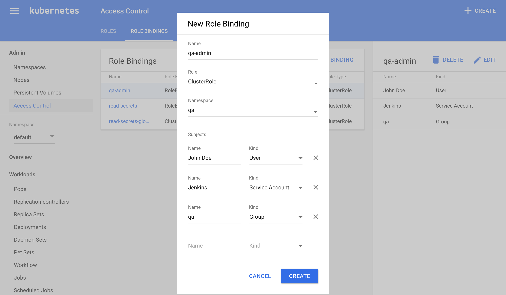

# UX for role-based access control

This design document is a proposal for a Dashboard UI that
allows users to manage Roles, RolesBindings, ClusterRoles, and 
ClusterRoleBindings in an intuitive way. This document is a 
formalization of ideas and discussions from #1441.

## Background

Kubernetes now allows cluster admins to use 
[role-based access control](http://kubernetes.io/docs/admin/authorization/) to secure their clusters. 
Permissions are managed using the following Kubernetes Resources:
* Role
* ClusterRole
* RoleBinding
* ClusterRoleBinding

None of these are reflected in the current version of Dashboard UI. There should a simplified, 
more user-friendly way to manage a cluster's access control by abstracting these raw concepts.

## Abstraction / Simplification

The only difference between Roles and ClusterRoles is that Roles apply to a specific namespace 
and ClusterRoles apply to all namespaces. The same is true for RoleBindings and ClusterRoleBindings. 
The UI should help users to understand these concepts and user flows should be designed to enforce
the correct usage. 

NOTE: The design proposed in this document will combine certain concepts:
* ClusterRoles will be referred to as Roles for the namespace "*"
* ClusterRoleBindings will be referred to as RoleBindings for the namespace "*"

## Use Cases

* Shortly introduce the concept of roles and bindings to the user
* Create a Role
* Bind subjects to a Role
* Edit a role's rules
* Unbind a subject from a role

# Design

## Overview

The overview can be reached by clicking the "Access Control" item in the admin section of the
left-hand menu. It shows existing Roles/Bindings, some important details for every item and allows
the user to create a new Role or Binding right away.

## Creating a role

Clicking the "+" under the existing Roles will open a dialog. After entering the name and
picking a namespace ("*" will create a ClusterRole), clicking "Create" will create the Role
and redirect the user to the Role's detail page.

## Bind subjects to a role

Clicking the "+" under the existing Bindings will open a dialog. After the selecting the
target role and the namespace ("*" will create a ClusterRoleBinding), clicking "Create"
will create the Binding and redirect the user to the Binding's detail page.

## View a role

By clicking on a list item in the overview, the user will be presented with a detail view.

## Edit a role

The only property of a Role that cannot be changed is its namespace, because it determines
if the Role is a ClusterRole or not. Apart from that, the user may add and remove resources
to a Role and change the selection of verbs that bound subjects will be allowed to use.

## Edit a binding

A Binding contains one or multiple subjects, which are displayed in a list under a box
that contains some general information about the selected Binding. The "+" button lets
the user add a subject, the hamburger buttons on the right allow for secondary actions like
deleting or editing a subject.

# Open Questions
* How many Roles/Bindings can usually be found in a cluster (avg,min,max)?

# Credits
[Source code](mockups/21-11-2016-access-control/dashboard-rbac-ui.bmpr)
of the mockups.

Proposed by [@mlamina](https://github.com/mlamina).