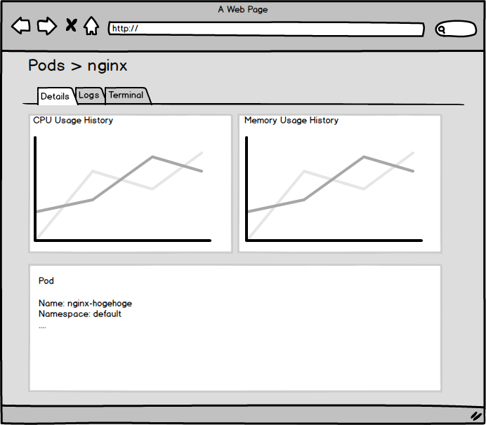
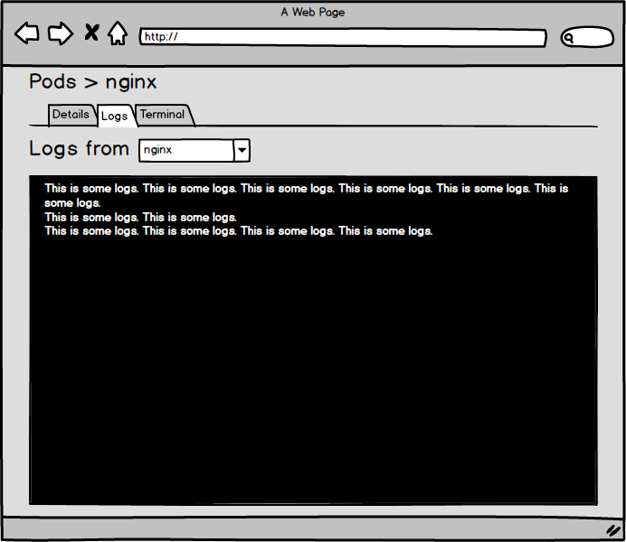
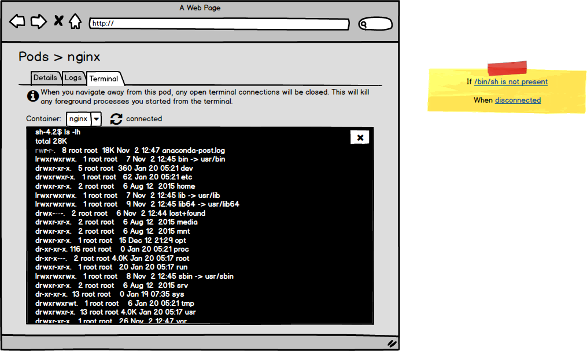
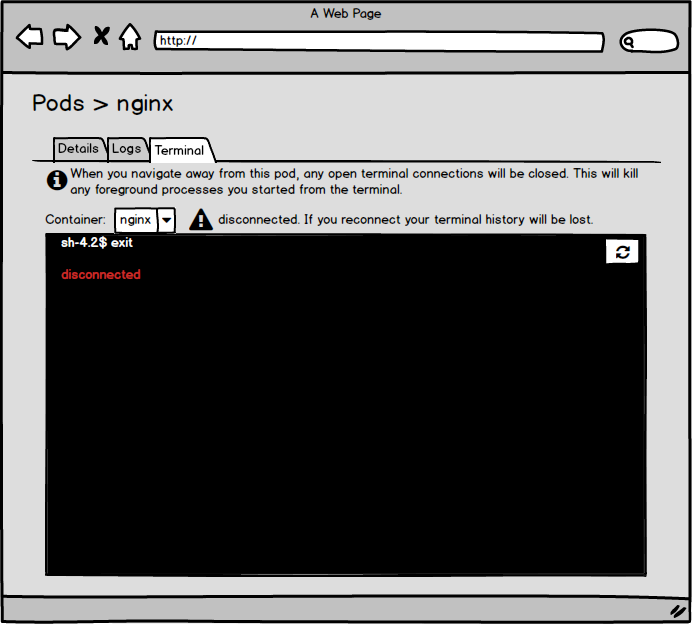
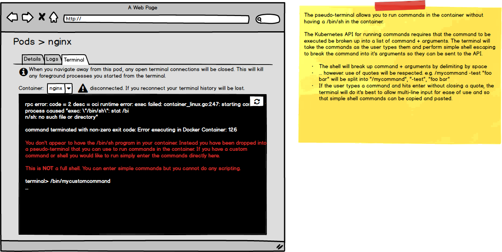

# Application Troubleshooting 

This design document is a proposal to consolidate add simple application
troubleshooting features in Dashboard UI.

## Background

The Kubernetes command line interface has several features for inspecting
applications running in Pods. Some examples are as follows.

- Viewing application logs (kubectl logs)
- Attaching to a running container (kubectl attach)
- Executing a process in a container and optionally opening a terminal session
  (kubectl exec)
- Port forwarding to a container (kubectl port-forward)
- Creating a proxy to the Kubernetes API server (kubectl proxy)

Troubleshooting and debugging have consistently been a top priority from a
users point of view. See:

- [Kubernetes UI Survey Nov 2016](https://github.com/kubernetes/dashboard/blob/master/docs/devel/images/kubecon-dashboard-survey-infographic-nov2016.png)
- [Kubernetes UI Survey Nov 2017](http://blog.kubernetes.io/2017/01/kubernetes-ux-survey-infographic.html)

## Problem Statement

- Update the UI to allow easier troubleshooting of problem containers
  - Allow users to execute process in containers running in pods and open a
    terminal session.
  - Improve the UI so that troubleshooting functions are easier to find and use.
  - Attaching to the container process (e.g. kubectl attach) will be out of scope
    due to priority. End users can usually solve their problem by viewing logs. 
  - Port forwarding and proxying to the API server will be out of scope due to
    low priority and technical issues.

## Design

The basis of the design is adding one new feature and rearranging existing
features in the UI so that troubleshooting features are logically grouped.

- Terminal: Allow users to execute a command in a container and attach a
  terminal to it from the UI.
- UI Improvements: Logically group the Pod details, Logs, and Terminal to allow
  for smoother troubleshooting. End users can switch between the views quickly
  and easily, without ending their session in other features.

### UI Improvements

The UI will be improved to add tabs to a pod detail page. The tabs will include:

- Pod details
- Logs
- Terminal

The tabs will allow the user to switch between the tabs without ending the
session in another tab (i.e. without reloading the page). This will be
especially important for the terminal feature so that users can view logs or
detail information about the pod while working and without loosing their place.

### Terminal

The terminal will allow users to execute arbitrary commands inside a pod's
container. When a user switches to the Terminal tab for the first time, a
terminal session is established. The terminal will attempt to run the standard
'/bin/sh' shell command in the container. If this command is present and
executable it should allow end users to execute arbitrary commands in the shell
environment.

The terminal will allow the user to switch between containers in the pod and
will show the status of the session. If the user's session becomes disconnected,
the terminal application will incidate this and allow the user to reconnect.

If the '/bin/sh' command is not present, the terminal will detect this and drop
the user into a pseudo-terminal that runs in the browser. The pseudo-terminal
allows users to run commands in the container without having a /bin/sh in the
container.

 
The Kubernetes API for running commands requires that the command to be
executed be broken up into a list of command + arguments. The pseudo-terminal
will take the commands as the user types them and perform simple shell escaping
to break the command into it's arguments so they can be sent to the API.
 
* The shell will break up command + arguments by delimiting by space
* ... however. use of quotes will be respected. e.g. /mycommand \-test "foo
  bar" will be split into "/mycommand", "-test", "foo bar"
* If the user types a command and hits enter without closing a quote, the
  terminal will do it's best to allow multi-line input for ease of use and so
  that simple shell commands can be copied and pasted.

#### Similar Features in Other UIs

Several other UIs have similar troubleshooting features.

##### OpenShift

The terminal feature was heavily influenced by the terminal feature in
OpenShift. OpenShift's terminal runs the '/bin/sh' command automatically as
outlined in this document, however it does not allow running of commands if the
'/bin/sh' command is not present in the container.

##### Cabin

Cabin is a mobile application for interacting with a Kubernetes cluster. Cabin
includes an exec feature that allows the user to execute commands in
containers. Cabin allows the execution of commands but does not support running
the command in a tty or piping stdin to the container.

