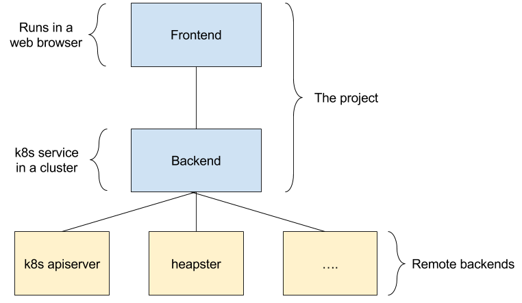

# Architecture

**IMPORTANT:** It reflects only the structure as of v2.0.0 and may not reflect the structure of
previous or future versions.

Kubernetes Dashboard project consists of two main components. They are called here the
frontend and the backend.

The frontend is a single page web application that runs in a browser. It fetches all its
business data from the backend using standard HTTP methods. It does not implement business logic,
it only presents fetched data and sends requests to the backend for actions.

The backend runs in a Kubernetes cluster as a Kubernetes service. Alternatively, it may run anywhere
outside of the cluster, given that it can connect to the control plane. The backend is an HTTP server
that proxies data requests to appropriate remote backends (e.g., Kubernetes API) or implements
business logic. The backend implements business logic when remote backends APIs do not
support required use case directly, e.g., “get a list of pods with their CPU usage metric
timeline”. The figure below outlines the architecture of the project:

The rationale for having a backend that implements business logic:

* Clear separation between the presentation layer (frontend) and business logic layer (backend).
This is because every action goes through well-defined API.
* Transactional actions are easier to implement on the backend than on the frontend. Examples of
such actions: "create a replication controller and a service for it" or "do a rolling update".
* Possible code reuse from existing tools (e.g., `kubectl`) and upstream contributions to the tools.
* Speed: getting composite data from backends is faster on the backend (if it runs close to the
data sources). For example, getting a list of pods with their CPU utilization timeline
requires at least two requests. Doing them on the backend shortens RTT.

## Backend

- Written in [Golang](https://golang.org/).
- Code and tests are stored in `src/app/backend` directory. Test file names start the same as sources, but they are with `_test.go`.
- Every API call hits `apihandler.go` which implements a series of handler functions to pass the results to resource-specific handlers.
- Backend currently doesn't implement a cache, so calls to the Dashboard API will always make fresh calls to the  Kubernetes API server.

## Frontend

- Written in [TypeScript](https://www.typescriptlang.org/).
- Using [Angular](https://angular.io/) along with [Angular Material](https://material.angular.io/) for components like cards, buttons etc.
- Using [Google Closure Compiler](https://developers.google.com/closure/compiler/).
- Code and the tests are stored in `src/app/frontend` directory. Test file names start the same as sources, but they are with `.spec.ts`.
- Frontend makes calls to the API and renders received data. It also transforms some data on the client and provides visualizations for the user. The frontend also makes calls to the API server to do things like exec into a container directly from the dashboard.

----
_Copyright 2019 [The Kubernetes Dashboard Authors](https://github.com/kubernetes/dashboard/graphs/contributors)_
